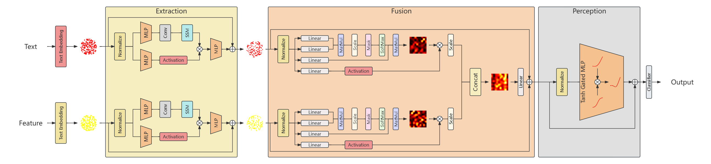
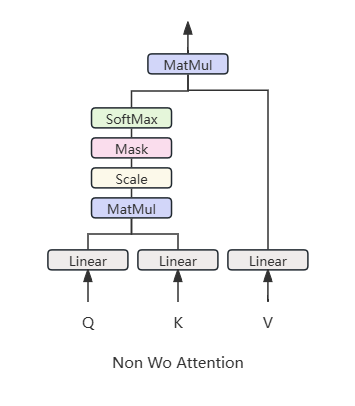
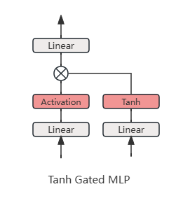
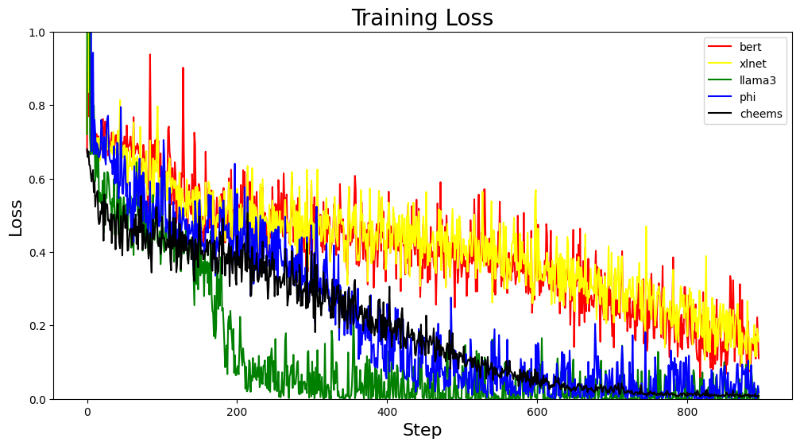
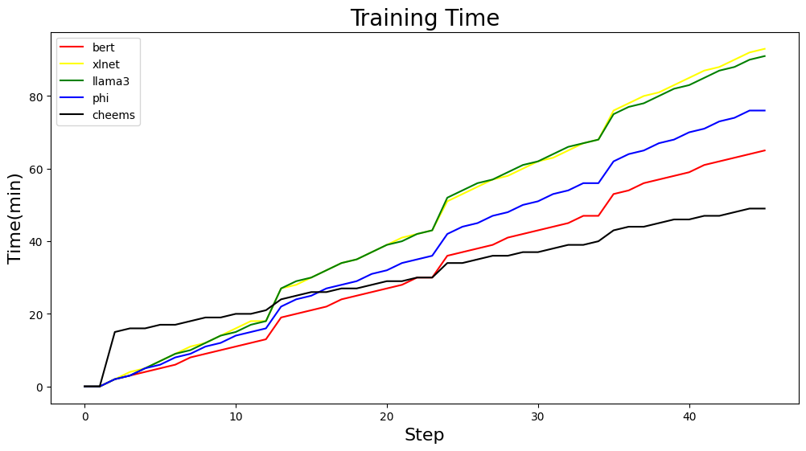
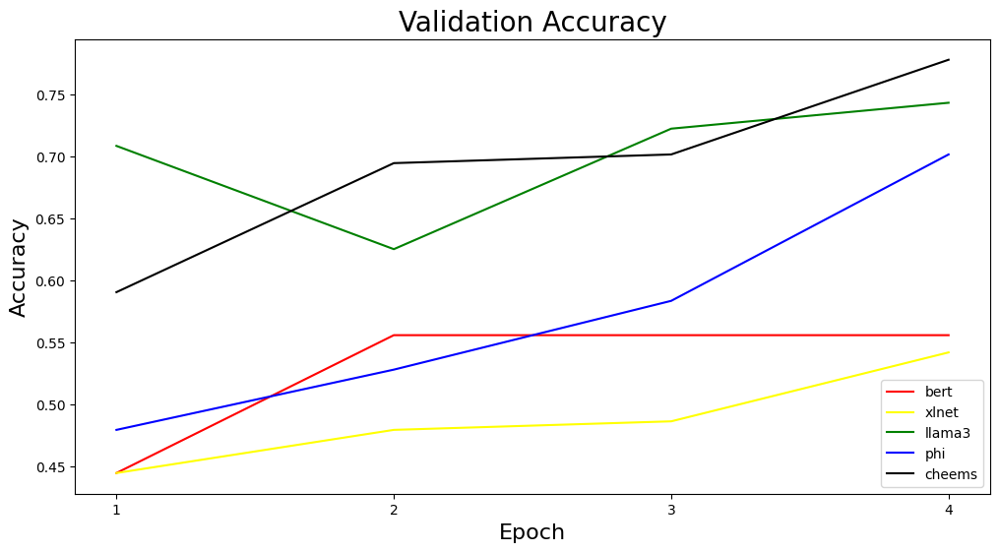

# 文本特征双模态融合增强医学分类

## 模型结构总图

我们提出了一种基于 Mamba 和 Attention 的双模态融合模型, 它包括三个阶段: 双模态有效信息提取, 双模态信息融合和融合信息感知.

## 双模态有效信息提取

Mamba 已被证明在需要长期依赖建模的任务中无法与 Transformer 竞争. 但是其能够根据输入有选择地选择相关信息, 对于所有非精心构造的数据集都是有取其精华弃其糟糠的优势. 因此, 我们使用 Mamba 作为有效信息提取器, 并更换其 `input linear` , `gate linear` 和 `output linear` 为 `MLP`, 以增加其表达能力.

## 双模态信息融合

在 Attention 中, 如果说 `Q` 相当于是一本没有热力图的书的原始文件, `K` 就相当于是在本书上你要注意的部分的热力图, `V` 相当于是你要注意的部分在原始文件的具体的东西, `V` 是 `Q` 的子集. `Q` 是原始数据, `K` 是提取原始数据的窗口, `V` 是被窗口提取的具体的值, 那么 `O` 则是最具体的值进行了加权的最终结果.

在原始的 Attention 中, `WQ`, `WK` , `WV` 和 `WO` 则是分别存储 `Q`, `K`, `V` 和 `O` 的权重. 我们将 `WO` 移动到外部, 使用 Non Wo Attention 来计算单个模态最终被提取的信息.

另外我们增加了一个门控分支来学习控制 Non Wo Attention 的信息流并增强构建长期依赖的能力.

然后我们将双模态的信息进行缩放, 这里的缩放因子也是可以学习的参数, 让模型通过训练自主决定各个模态信息的重要性.

$$
Scale(x, W, W_2) = x \times e^{W}
$$

最后我们将双模态信息在隐藏维度上进行拼接, 使其通过 `WO` 得到最终的融合信息.

## 融合信息感知

由于在通过 MLP 之前我们进行了归一化操作确保数据在后续的神经网络层中能够得到更好的处理, 避免极端值对模型性能造成过大影响, 在进行归一化操作后, 数据的分布范围已经缩小到了一个更小的区间内.

Gated MLP 包含门控分支, 门控可以根据输入的特征选择性地激活或抑制某些神经元. 这种结构可以帮助模型更好地捕捉和利用数据的潜在模式.

Tanh 函数输出范围在[-1, 1]之间. 相比于其他如ReLU等激活函数, Tanh函数提供了平滑的梯度, 并且在处理负数时不会出现饱和现象. 因此, 我们将 Gated MLP 中门控分支的激活函数更换为 Tanh 函数.

我们将激活函数从门控分支移至主干分支直接利用主干分支的信息进行非线性转换, 然后再与门控分支的信息进行融合, 以帮助模型更好地适应数据变化, 提高泛化能力.

## 实验结果

我们在[cerebral stroke predictionimbalaced](https://www.kaggle.com/datasets/shashwatwork/cerebral-stroke-predictionimbalaced-dataset)数据集上进行了训练, 在[stroke prediction dataset](https://www.kaggle.com/datasets/fedesoriano/stroke-prediction-dataset)数据集上进行了验证, 结果如下:

我们的模型训练损失更平滑, 训练时间更短, 验证准确率更高.

